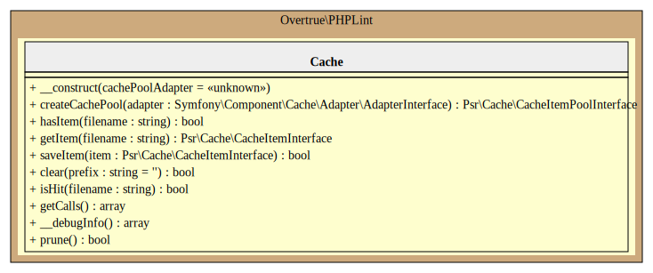

# Cache

PHPLint uses the [Symfony Cache Component][symfony/cache] to speed-up execution of new re-analysis.

## Null Cache Adapter

This adapter allow to store/do nothing, but keep API homogeneous.

## Filesystem Cache Adapter

This [adapter][filesystem-adapter] stores the cache item contents (file fingerprint) as regular files in a collection
of directories on a locally mounted filesystem (default to `.phplint.cache` directory into the working directory).

You can change this directory with the `cache` option. See [Configuration](../configuration.md#cache-cache) chapter.

## UML Diagram

Generated by [bartlett/umlwriter][bartlett/umlwriter] package.

[bartlett/umlwriter]: https://github.com/llaville/umlwriter
[symfony/cache]: https://github.com/symfony/cache
[filesystem-adapter]: https://symfony.com/doc/current/components/cache/adapters/filesystem_adapter.html
