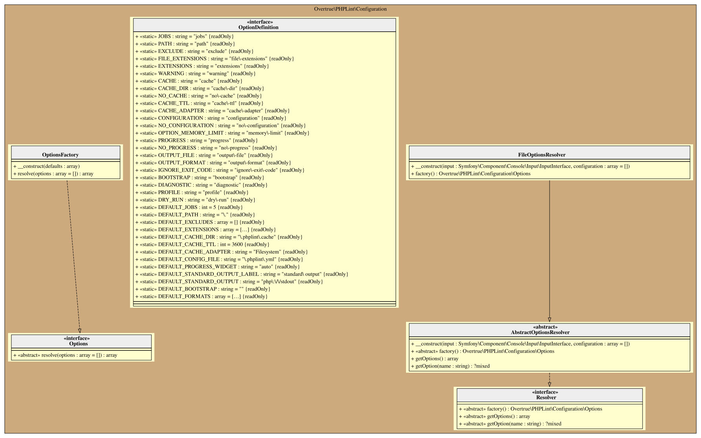

# Configuration

PHPLint uses the [Symfony OptionsResolver Component][symfony/options-resolver] to validate configuration 
from console arguments/options and/or YAML,JSON,PHP file.

One active Options Resolver exists (`FileOptionsResolver`), 
and implement the [Factory method pattern][factory-method-pattern].

## FileOptionsResolver

This resolver is used if you specify the `--configuration` option. 
When configuration file exists, is readable and decodable, it will be automatically used.

> [!WARNING]
> On legacy mode (`PLINT_MODE=legacy`), only YAML configuration is supported, 
> while new API 9.8 is able to scans (`PLINT_CONFIG=auto`, `--configuration auto`) 
> supported `.phplint` and `.phplint.dist` file candidates (php, yaml, yml, and json).

## UML Diagram

Generated by [bartlett/graph-uml][bartlett/graph-uml] package via the `resources/graph-uml/build.php` script.

[bartlett/graph-uml]: https://packagist.org/packages/bartlett/graph-uml
[symfony/options-resolver]: https://github.com/symfony/options-resolver
[factory-method-pattern]: https://en.wikipedia.org/wiki/Factory_method_pattern
