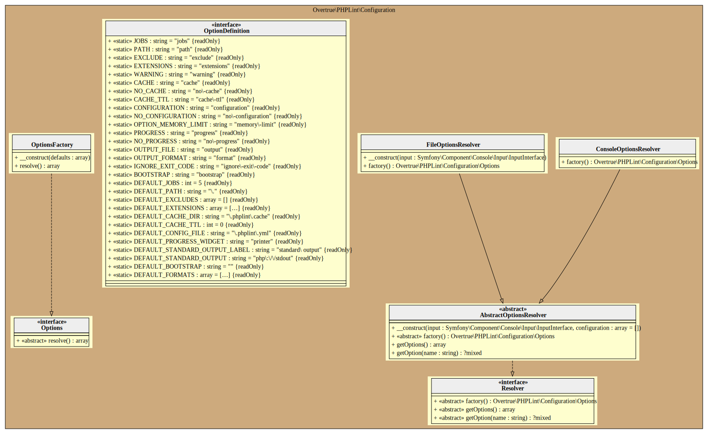

# Configuration

PHPLint uses the [Symfony OptionsResolver Component][symfony/options-resolver] to validate configuration 
from console arguments/options and/or YAML file.

Two Options Resolver exists (`ConsoleOptionsResolver`, `FileOptionsResolver`), 
each one's implement the [Factory method pattern][factory-method-pattern].

## ConsoleOptionsResolver

This resolver is used if you specify the `--no-configuration` option. In this case, 
only arguments and options from console command line are used.

## FileOptionsResolver

This resolver is used if you specify the `--configuration` option. 
When YAML configuration file exists and is loadable, it will be automatically used.

## UML Diagram

Generated by [bartlett/umlwriter][bartlett/umlwriter] package.

[bartlett/umlwriter]: https://github.com/llaville/umlwriter
[symfony/options-resolver]: https://github.com/symfony/options-resolver
[factory-method-pattern]: https://en.wikipedia.org/wiki/Factory_method_pattern
