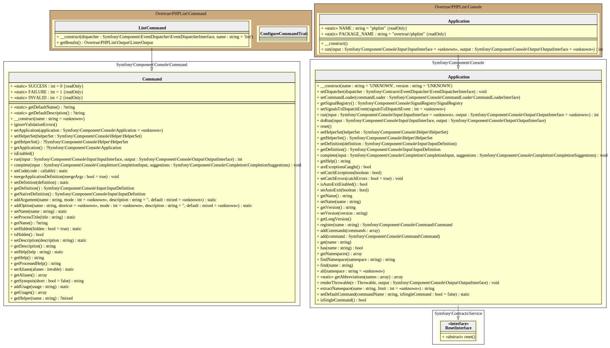

# Console

PHPLint is a CLI Application with a single command built over the [Symfony Console Component][symfony/console].

## UML Diagram

Generated by [bartlett/graph-uml][bartlett/graph-uml] package via the `resources/graph-uml/build.php` script.

[bartlett/graph-uml]: https://packagist.org/packages/bartlett/graph-uml
[symfony/console]: https://symfony.com/doc/current/components/console.html
