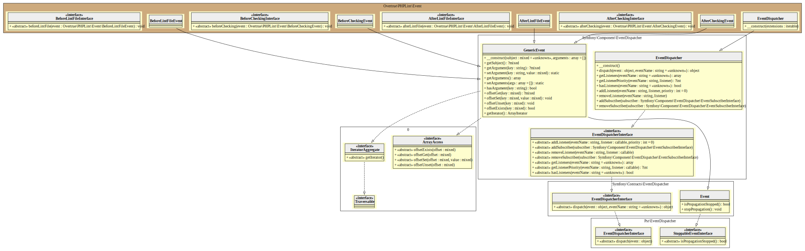

# [Event-Driven Architecture on Wikipedia][eda]

PHPLint uses the [Symfony Event-Dispatcher Component][symfony/event-dispatcher] to communicate with each internal element's
by dispatching events and listening to them.

That's allow to easily add new `Extension` (like progress `bar` and `meter` widgets), but also new output formats. 

## UML Diagram



Generated by [bartlett/umlwriter][bartlett/umlwriter] package.

## The Dispatcher

The dispatcher is the central object of the event dispatcher system. It accepts a list of `Extension` objects 
that will extend PHPLint features (widgets, output formats, ...)

Each `Extension` that will add new listeners must implement the Symfony [EventSubscriberInterface][EventSubscriberInterface] 
and also must implement one or more following PHPLint Event Interface:  

- `BeforeCheckingInterface`:  called before lint begins to run
- `AfterCheckingInterface` : called after lint is completed
- `BeforeLintFileInterface`: called before a file has been checked
- `AfterLintFileInterface`: called after a file has been checked

## Example(s)

Default progress printer widget: 

```php 
<?php
use Overtrue\PHPLint\Event\EventDispatcher;
use Overtrue\PHPLint\Extension\ProgressPrinter;

$extensions = [new ProgressPrinter()];

$dispatcher = new EventDispatcher($extensions);

```

[eda]: https://en.wikipedia.org/wiki/Event-driven_architecture
[bartlett/umlwriter]: https://github.com/llaville/umlwriter
[symfony/event-dispatcher]: https://github.com/symfony/event-dispatcher
[EventSubscriberInterface]: https://github.com/symfony/symfony/blob/5.4/src/Symfony/Component/EventDispatcher/EventSubscriberInterface.php
