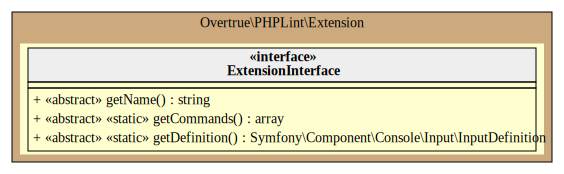

# Extension

PHPLint may be extended with many other new features by using concept of extension. 
Each extension is based on [Event Driven Architecture](./event.md)

## UML Diagram



Generated by [bartlett/graph-uml][bartlett/graph-uml] package via the `resources/graph-uml/build.php` script.

## OutputFormat

This extension is responsible to print results to target defined by option. See Example below.

**NOTE**: Version 9.0 supports JSON (`log-json`) and Junit (`log-junit`) format.

Whatever you specify zero or more option, results will always be printed to standard output (see `Overtrue\PHPLint\Output\ConsoleOutput` object).
unless you give `--quiet`.

## ProgressPrinter

This extension is responsible to print progress of file checking.

Here is preview of what it will look like : 


## ProgressBar

This extension is responsible to print progress of file checking with the [Symfony ProgressBar Console Helper][symfony-progressbar]

Here is preview of what it will look like :


## ProgressIndicator

This extension is useful to let users know that the `phplint` command isn't stalled.
Learn more with the official Symfony documentation on [ProgressIndicator Console Helper][symfony-progressindicator]


## Example(s)

Default progress printer widget:

```php 
<?php
use Overtrue\PHPLint\Extension\ProgressPrinter;

$extensions = [new ProgressPrinter()];

```

Default progress bar widget:

```php 
<?php
use Overtrue\PHPLint\Extension\ProgressBar;

$extensions = [new ProgressBar()];

```

Default progress indicator widget:

```php 
<?php
use Overtrue\PHPLint\Extension\ProgressIndicator;

$extensions = [new ProgressIndicator()];

```

Default outputs (console, JSON and Junit formats):

```php 
<?php
use Overtrue\PHPLint\Configuration\OptionDefinition;
use Overtrue\PHPLint\Extension\OutputFormat;

$extensions = [
    new OutputFormat([
        OptionDefinition::LOG_JSON,
        OptionDefinition::LOG_JUNIT,
    ])
];

```

[bartlett/graph-uml]: https://packagist.org/packages/bartlett/graph-uml
[symfony-progressbar]: https://symfony.com/doc/current/components/console/helpers/progressbar.html
[symfony-progressindicator]: https://symfony.com/doc/current/components/console/helpers/progressindicator.html