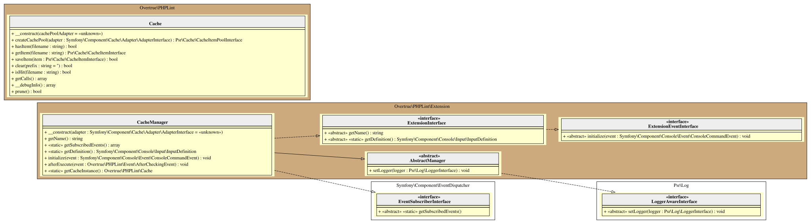

# Cache Manager

This extension/plugin is in charge to :

1. speed-up execution of new re-analysis.
2. checks if adapter choice is a valid/compatible with the [Symfony Cache Component][symfony/cache].

> [!NOTE] 
> - It will expose three additional flags (`--cache-adapter`, `--cache-dir`, `--cache-ttl`) to the core `lint` command (the only one allowed).

## Default Cache Adapter 

This `null` adapter allow to store/do nothing, but keep API homogeneous.

## Filesystem Cache Adapter

This [adapter][filesystem-adapter] stores the cache item contents (file fingerprint) as regular files in a collection
of directories on a locally mounted filesystem (default to `.phplint.cache` directory into the working directory).

## UML Diagram

Generated by [bartlett/graph-uml][bartlett/graph-uml] package via the `resources/graph-uml/build.php` script.

[bartlett/graph-uml]: https://packagist.org/packages/bartlett/graph-uml
[symfony/cache]: https://github.com/symfony/cache
[filesystem-adapter]: https://symfony.com/doc/current/components/cache/adapters/filesystem_adapter.html
