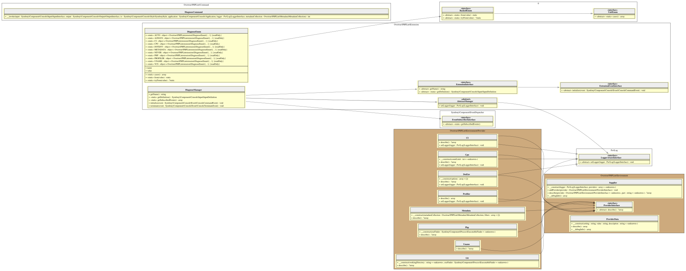

# Diagnose Manager

This extension/plugin is in charge to :

1. initialize diagnostic process after execution of the `lint` command.
2. terminate diagnostic results output after execution of the `lint` command.

> [!NOTE]
> Do not expose additional flags to the core `lint` command (the only one allowed).

## Initialize diagnostic results output

The diagnostic is launched (core `diagnose` command) if you allow it:

- that means if `PLINT_DIAGNOSTIC` environment variable is not set to `never`,
- or if `-q, --quiet` flag of the Symfony Command is not provided

## Terminate diagnostic results output

PHPLint 9.8 is embedded with eight diagnostic providers : 

- `Overtrue\PHPLint\Environment\Provider\CI` (use optional [ondram/ci-detector] package)
- `Overtrue\PHPLint\Environment\Provider\Cpu` (use optional [fidry/cpu-core-counter] package)
- `Overtrue\PHPLint\Environment\Provider\DotEnv` (use optional [symfony/dotenv] package)
- `Overtrue\PHPLint\Environment\Provider\Git`
- `Overtrue\PHPLint\Environment\Provider\Metadata`
- `Overtrue\PHPLint\Environment\Provider\Php`
- `Overtrue\PHPLint\Environment\Provider\Profiler` (use optional [symfony/stopwatch] package)
- `Overtrue\PHPLint\Environment\Provider\Uname`

> [!TIP]
> You can use also your own provider. See `examples/envProvider` directory for an implementation example.
> In this context, the `PLINT_DIAGNOSTIC` environment variable should identify the FQCN user class.

Results depends on the `PLINT_DIAGNOSTIC` environment variable setting.

- `ci` to print Continuous Integration environment and current build information
- `cpu` to get information about your CPU cores (parallelization capability feature)
- `dotenv` to get values of `XDG` and `PLINT` prefixed environment variables.
- `vcs` to get detailed information of your Git clone local version.
- `metadata` to print results of one of metadata available. 
  Names allowed are `application_version`, `current_configuration`, `linter_results`, `profile_results`, `cache_results`
- `php` to get information about your PHP environment
- `profiler` to know if the profiler is available or not
- `uname` to get information about your OS environment

> [!NOTE]
> You can enable multiple diagnostic at the same time by comma separating their identifiers as value to `PLINT_DIAGNOSTIC`

## UML Diagram

Generated by [bartlett/graph-uml][bartlett/graph-uml] package via the `resources/graph-uml/build.php` script.

[bartlett/graph-uml]: https://packagist.org/packages/bartlett/graph-uml
[ondram/ci-detector]: https://github.com/ondram/ci-detector
[fidry/cpu-core-counter]: https://github.com/theofidry/cpu-core-counter
[symfony/dotenv]: https://github.com/symfony/dotenv
[symfony/stopwatch]: https://github.com/symfony/stopwatch
