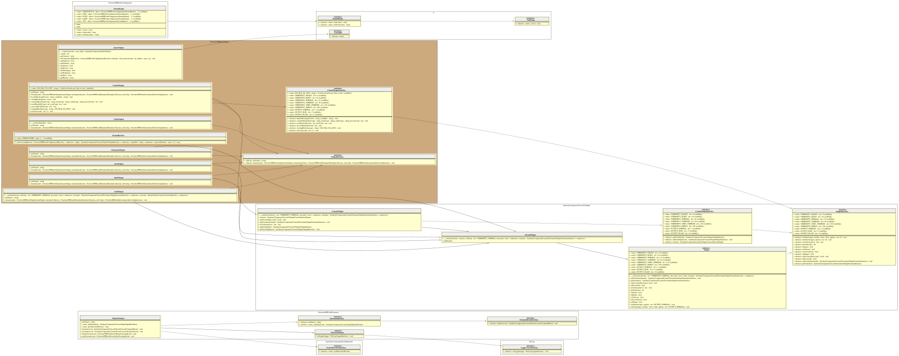

# Output Manager

This extension/plugin is in charge to : 

1. Expose two additional flags: `--output-format` and `--output-file` to the core `lint` command (the only one allowed).
2. initialize results output of the `lint` command.
3. terminate results output of the `lint` command.

## Initialize results output

The `FormatResolver` is in charge to detect what output handler PHPLint must be used to print results,
depending of the `$requestFormats` provided (see `--output-format` flag on console usage).

## Terminate results output

The `ChainOutput` is the main handler that drive all others and delegate the results to print on each `format` process.

> [!CAUTION]
> Since PHPLint 9.8, you must use the `Overtrue\PHPLint\Metadata\LinterOutput` metadata 
> (that is available into the `MetadataCollection`) instead of `Overtrue\PHPLint\Output\LinterOutput` that is now deprecated,
> and will be removed in next API version.

You can define your own additional driver/handler that should adhere to the `OutputInterface` contract. 

## UML Diagram

Generated by [bartlett/graph-uml][bartlett/graph-uml] package via the `resources/graph-uml/build.php` script.

[bartlett/graph-uml]: https://packagist.org/packages/bartlett/graph-uml
