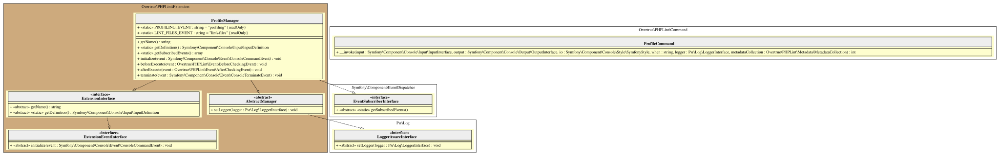

# Profile Manager

This extension/plugin is in charge to :

1. check if the profiler (`symfony/stopwatch` package) is installed or not
2. launch execution of internal `profile` command that will display time elapsed, memory consumed, and cache usage.

> [!NOTE]
> It will expose one additional flag (`--profile`) to the core `lint` command (the only one allowed).

## Initialize the profiler

Event : `Symfony\Component\Console\Event\ConsoleCommandEvent`

- `auto` : check if the profiler is installed, and if the `lint` command was not run with `--dry-run` flag.
- `never` : do nothing

## Terminate the profiler

Event : `Symfony\Component\Console\Event\ConsoleTerminateEvent`

If previous initialization of the profile was OK, then we launch execution of internal `profile` command.

## Additional events listen

 may listen on following events :

- `Overtrue\PHPLint\Event\BeforeCheckingEvent` is triggered by the `Overtrue\PHPLint\Linter` just before scan all files
- `Overtrue\PHPLint\Event\AfterCheckingEvent` is triggered by the `Overtrue\PHPLint\Linter` to transmit results to all output handlers

## UML Diagram

Generated by [bartlett/graph-uml][bartlett/graph-uml] package via the `resources/graph-uml/build.php` script.

[bartlett/graph-uml]: https://packagist.org/packages/bartlett/graph-uml

