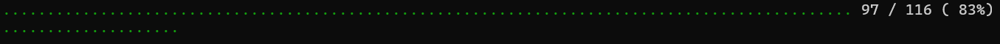
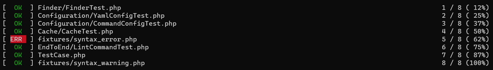
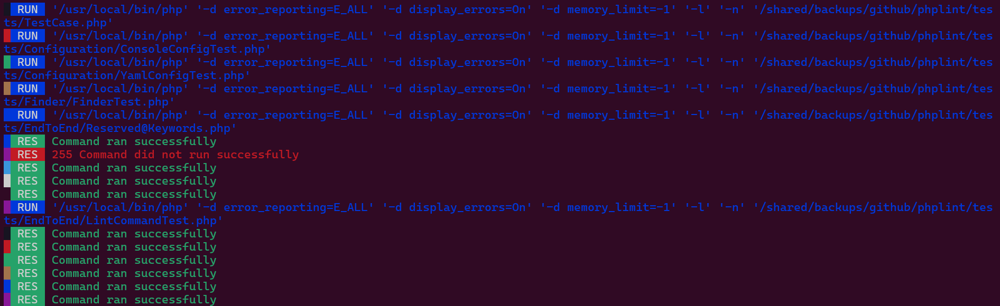
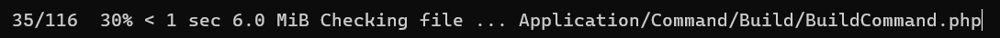

## ProgressManager

This extension is in charge to handle properly the file checking progression depending on the format supported.

Set type of progress output (with `--progress` flag)

Supported values are:

- `auto` (default): Print progress output like `--progress dots` (or `--progress printer` previous value supported but now deprecated)
- `dots`: (same as `--progress printer` deprecated flag option)
- `plain`: Prints the raw build progress in a plaintext format (same as `--vv`: verbose level 2)
- `bar`: Prints a standard Symfony Progress Bar.
- `indicator`: Let users know that the `phplint` command isn't stalled.
- `quiet`: Suppress any progression output (same as `--no-progress`)

## With `--progress dots`

Here is preview of what it will look like :

## With `--progress plain`

Here is preview of what it will look like :

## With `--progress bar`

This flag option is responsible to print progress of file checking with the [Symfony ProgressBar Console Helper][symfony-progressbar]

Here is preview of what it will look like :

## With `--progress indicator`

This flag option is useful to let users know that the `phplint` command isn't stalled.
Learn more with the official Symfony documentation on [ProgressIndicator Console Helper][symfony-progressindicator]

[bartlett/graph-uml]: https://packagist.org/packages/bartlett/graph-uml
[symfony-progressbar]: https://symfony.com/doc/current/components/console/helpers/progressbar.html
[symfony-progressindicator]: https://symfony.com/doc/current/components/console/helpers/progressindicator.html