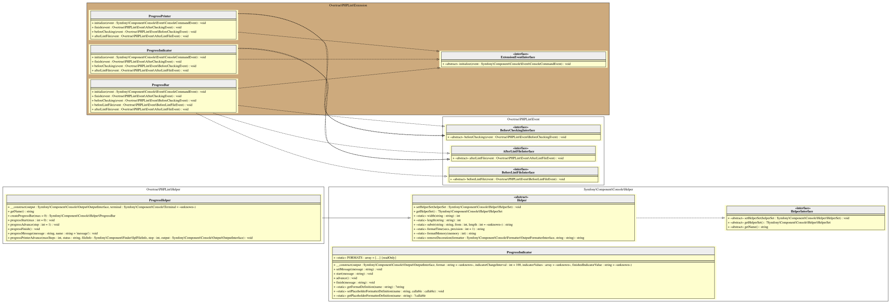

# Progress Manager

This extension/plugin is in charge to :

1. initialize scan progression output after execution of the `lint` command.
2. terminate scan progression output after execution of the `lint` command.

> [!NOTE]
> It will expose two additional flags (`--progress`, `--no-progress`) to the core `lint` command (the only one allowed).

> [!CAUTION]
> The `--no-progress` flag should be avoided (marked as deprecated, and will be removed in next API versions),
> and replaced by `--progress quiet` instead.

## Initialize scan progression output

This extension delegate internal operation to following widget, each one correspond to a `--progress` flag value.

Event : `Symfony\Component\Console\Event\ConsoleCommandEvent`

- `auto` : delegate event to the `Overtrue\PHPLint\Extension\ProgressPrinter` class
- `dots` : delegate event to the `Overtrue\PHPLint\Extension\ProgressPrinter` class
- `plain` : delegate event to the `Overtrue\PHPLint\Extension\ProgressPrinter` class
- `bar` : delegate event to the `Overtrue\PHPLint\Extension\ProgressBar` class
- `indicator` : delegate event to the `Overtrue\PHPLint\Extension\ProgressIndicator` class

## Terminate scan progression output

Delegate event (`Overtrue\PHPLint\Event\AfterCheckingEvent`) to the same widget class that was initialized previously.

## Additional events listen

Each widget may listen on following events :

- `Overtrue\PHPLint\Event\BeforeCheckingEvent` is triggered by the `Overtrue\PHPLint\Linter` just before scan all files
- `Overtrue\PHPLint\Event\BeforeLintFileEvent` is triggered by the `Overtrue\PHPLint\Linter` just before to scan a file
- `Overtrue\PHPLint\Event\AfterLintFileEvent` is triggered by the `Overtrue\PHPLint\Linter` after a file is scanned

## UML Diagram

Generated by [bartlett/graph-uml][bartlett/graph-uml] package via the `resources/graph-uml/build.php` script.

[bartlett/graph-uml]: https://packagist.org/packages/bartlett/graph-uml

