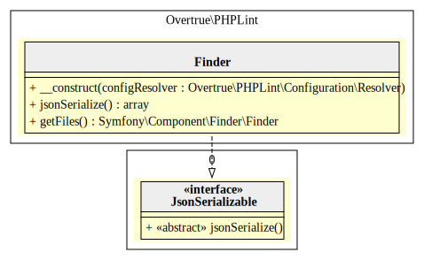

# Finder

PHPLint uses the [Symfony Finder Component][symfony/finder] to find files to check from one or more path to your local filesystem.

It requires the Options Resolver object (either `ConsoleOptionsResolver` or `FileOptionsResolver`) to retrieve 
configuration values (`path`, `exclude`, `extensions`).

If you prefer a programmatically approach, because you have a complex files finds strategy, 
you can replace the `Overtrue\PHPLint\Finder` object by any Symfony Finder instance.

## UML Diagram

Generated by [bartlett/umlwriter][bartlett/umlwriter] package.

[bartlett/umlwriter]: https://github.com/llaville/umlwriter
[symfony/finder]: https://github.com/symfony/finder
