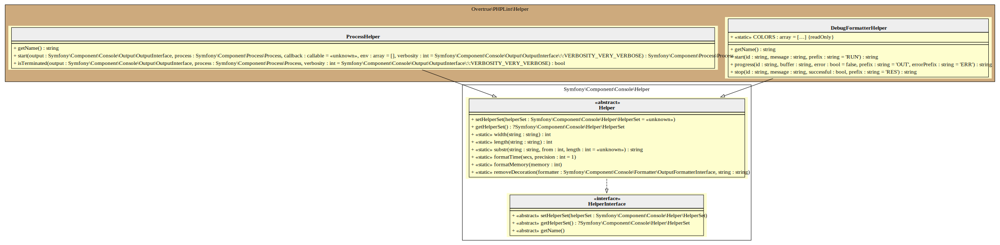

# Helper

PHPLint uses two adapted Symfony Console helpers 
([ProcessHelper][symfony/process-helper] and [DebugFormatterHelper][symfony/debug-formatter-helper]) 
for debugging asynchronous processes.

You've just to use verbose level 2 or 3 to see live results.

## UML Diagram

Generated by [bartlett/graph-uml][bartlett/graph-uml] package via the `resources/graph-uml/build.php` script.

[bartlett/graph-uml]: https://packagist.org/packages/bartlett/graph-uml
[symfony/process-helper]: https://symfony.com/doc/current/components/console/helpers/processhelper.html
[symfony/debug-formatter-helper]: https://symfony.com/doc/current/components/console/helpers/debug_formatter.html
