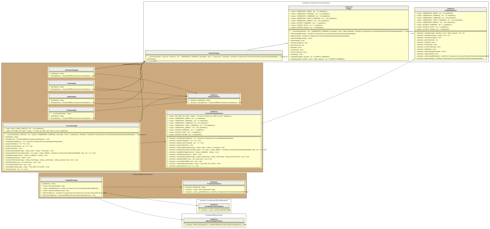

# Output (formats)

PHPLint application is based on [Symfony Console Component][symfony/console] that hook into lifecycle of console application 
[using events][symfony-console-events].

When you enable the `OutputFormat` extension, PHPLint use the [chain-of-responsibility pattern][chain-of-responsibility-pattern]
via the `Overtrue\PHPLint\Output\ChainOutput` object and its handlers (`Overtrue\PHPLint\Output\*Output`): 

- `ConsoleOutput` print results to the standard output
- `JsonOutput` print results on JSON format to a file (default to standard output)
- `JunitOutput` print results on Junit format to a file (default to standard output)
- `CheckstyleOutput` print results on Checkstyle format to a file (default to standard output)
- `SarifOutput` print results on SARIF format to a file (default to standard output)

## UML Diagram



Generated by [bartlett/graph-uml][bartlett/graph-uml] package via the `resources/graph-uml/build.php` script.

## `ConsoleOutput` handler 

This default handler is responsible to print PHPLint results to standard output. For example:


## `JsonOutput` handler 

This handler is responsible to print PHPLint results on JSON private format. For example: 

```json
{
    "status": "failure",
    "failures": {
        "/path/to/tests/fixtures/syntax_error.php": {
            "absolute_file": "/path/to/tests/fixtures/syntax_error.php",
            "relative_file": "fixtures/syntax_error.php",
            "error": "unexpected end of file in line 4",
            "line": 4
        },
        "/path/to/tests/fixtures/php-8.2_syntax.php": {
            "absolute_file": "/path/to/tests/fixtures/php-8.2_syntax.php",
            "relative_file": "fixtures/php-8.2_syntax.php",
            "error": "False can not be used as a standalone type in line 12",
            "line": 12
        }
    },
    "application_version": {
        "long": "phplint 9.4.0",
        "short": "9.4.0"
    },
    "time_usage": "< 1 sec",
    "memory_usage": "6.0 MiB",
    "cache_usage": "0 hit, 12 misses",
    "process_count": 12,
    "files_count": 12,
    "options_used": {
        "path": [
            "tests/"
        ],
        "configuration": ".phplint.yml",
        "no-configuration": true,
        "exclude": [],
        "extensions": [
            "php"
        ],
        "jobs": 5,
        "no-cache": true,
        "cache": ".phplint.cache",
        "no-progress": false,
        "progress": "printer",
        "log-json": "php://stdout",
        "log-junit": false,
        "warning": false,
        "memory-limit": "512M",
        "ignore-exit-code": false
    }
}
```

## `JunitOutput` handler 

This handler is responsible to print PHPLint results on Junit XML format. For example:

```xml
<?xml version="1.0" encoding="UTF-8"?>
<testsuites>
  <testsuite name="PHP Linter 9.4.0" timestamp="2024-07-05T08:21:51+0000" time="&lt; 1 sec" tests="1" errors="2">
    <testcase errors="2" failures="0">
      <error type="Error" message="unexpected end of file in line 4">/path/to/fixtures/syntax_error.php</error>
      <error type="Error" message="False can not be used as a standalone type in line 12">/path/to/fixtures/php-8.2_syntax.php</error>
    </testcase>
  </testsuite>
</testsuites>
```

## `CheckstyleOutput` handler

This handler is responsible to print PHPLint results on Checkstyle XML format. For example:

```xml
<?xml version="1.0" encoding="UTF-8"?>
<checkstyle>
  <file name="/path/to/fixtures/syntax_error.php">
    <error line="4" severity="error" message="unexpected end of file in line 4"/>
  </file>
  <file name="/path/to/fixtures/php-8.2_syntax.php">
    <error line="12" severity="error" message="False can not be used as a standalone type in line 12"/>
  </file>
  <file name="/path/to/fixtures/syntax_warning.php">
    <error line="12" severity="error" message=" declare(encoding=...) ignored because Zend multibyte feature is turned off by settings in line 12"/>
  </file>
</checkstyle>
```

## `SarifOutput` handler

> [!NOTE]
>
> Since version 9.4.0, this format is optional and requires an extra package to be installed.
>
> ```composer require --dev bartlett/sarif-php-converters```

This handler is responsible to print PHPLint results on SARIF JSON format. 
Learn more at <https://github.com/llaville/sarif-php-converters/blob/1.0/docs/converter/phplint.md>

## `LinterOutput` object

This object represent the PHPLint results of all file checked.

It will allow to easily communicate with other extension or output handler. Thanks to the Event-Dispatcher component.

[bartlett/graph-uml]: https://packagist.org/packages/bartlett/graph-uml
[symfony/console]: https://github.com/symfony/console
[symfony-console-events]: https://symfony.com/doc/current/components/console/events.html
[chain-of-responsibility-pattern]: https://en.wikipedia.org/wiki/Chain-of-responsibility_pattern

