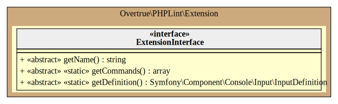
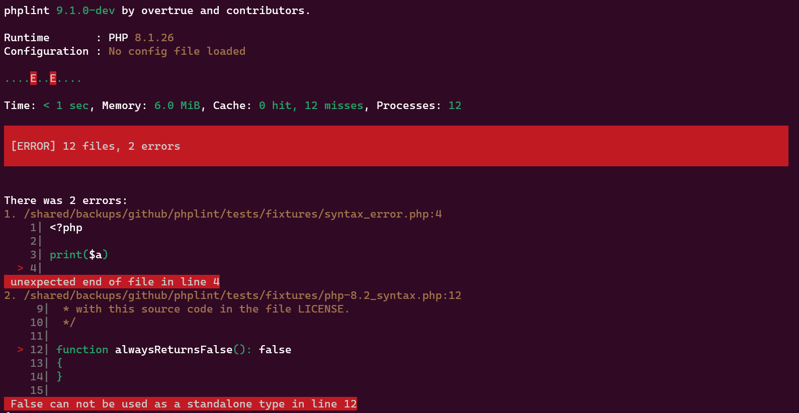

# Output (formats)

PHPLint application is based on [Symfony Console Component][symfony/console] that hook into lifecycle of console application 
[using events][symfony-console-events].

When you enable the `OutputFormat` extension, PHPLint use the [chain-of-responsibility pattern][chain-of-responsibility-pattern]
via the `Overtrue\PHPLint\Output\ChainOutput` object and its handlers (`Overtrue\PHPLint\Output\*Output`): 

- `ConsoleOutput` print results to the standard output
- `JsonOutput` print results on JSON format to a file (default to standard output)
- `JunitOutput` print results on Junit format to a file (default to standard output)

## UML Diagram



Generated by [bartlett/umlwriter][bartlett/umlwriter] package.

## `ConsoleOutput` handler 

This default handler is responsible to print PHPLint results to standard output. For example:



## `JsonOutput` handler 

This handler is responsible to print PHPLint results on JSON private format. For example: 

```json
{
    "status": "failure",
    "failures": {
        "/path/to/tests/fixtures/syntax_error.php": {
            "absolute_file": "/path/to/tests/fixtures/syntax_error.php",
            "relative_file": "fixtures/syntax_error.php",
            "error": "unexpected end of file in line 4",
            "line": 4
        }
    },
    "time_usage": "< 1 sec",
    "memory_usage": "6.0 MiB",
    "cache_usage": "0 hit, 8 misses",
    "files_count": 8,
    "options_used": {
        "command": "lint",
        "path": [
            "tests/"
        ],
        "exclude": [],
        "extensions": [
            "php"
        ],
        "jobs": 5,
        "configuration": ".phplint.yml",
        "no-configuration": true,
        "no-cache": true,
        "cache": ".phplint.cache",
        "no-progress": false,
        "progress": "bar",
        "log-json": "php://stdout",
        "log-junit": null,
        "warning": false,
        "memory-limit": "512M",
        "ignore-exit-code": false,
        "help": false,
        "quiet": false,
        "verbose": true,
        "version": false,
        "ansi": null,
        "no-interaction": false
    }
}
```

## `JunitOutput` handler 

This handler is responsible to print PHPLint results on Junit XML format. For example:

```xml
<?xml version="1.0" encoding="UTF-8"?>
<testsuites>
  <testsuite name="PHP Linter" timestamp="2023-02-06T13:12:22+0000" time="&lt; 1 sec" tests="1" errors="1">
    <testcase errors="1" failures="0">
      <error type="Error" message="unexpected end of file in line 4">/path/to/tests/fixtures/syntax_error.php
    </testcase>
  </testsuite>
</testsuites>
```

[bartlett/umlwriter]: https://github.com/llaville/umlwriter
[symfony/console]: https://github.com/symfony/console
[symfony-console-events]: https://symfony.com/doc/current/components/console/events.html
[chain-of-responsibility-pattern]: https://en.wikipedia.org/wiki/Chain-of-responsibility_pattern


## `LinterOutput` object

This object represent the PHPLint results of all file checked.

It will allow to easily communicate with other extension or output handler. Thanks to the Event-Dispatcher component.
