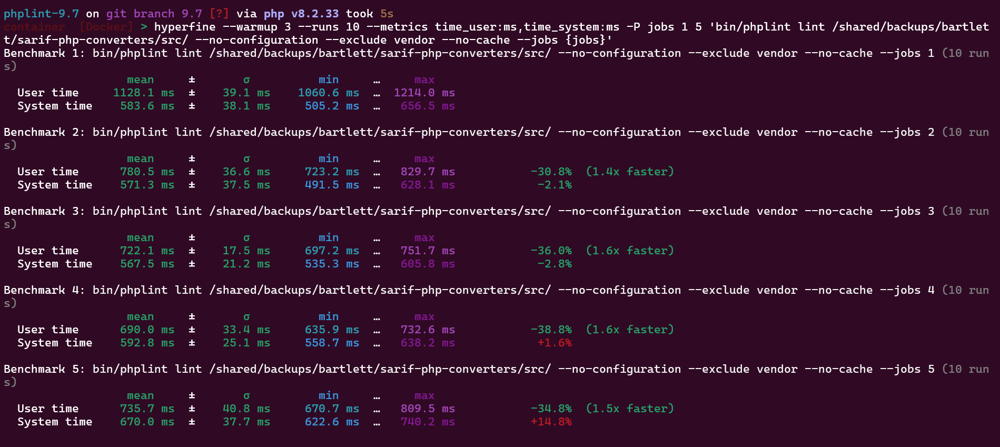
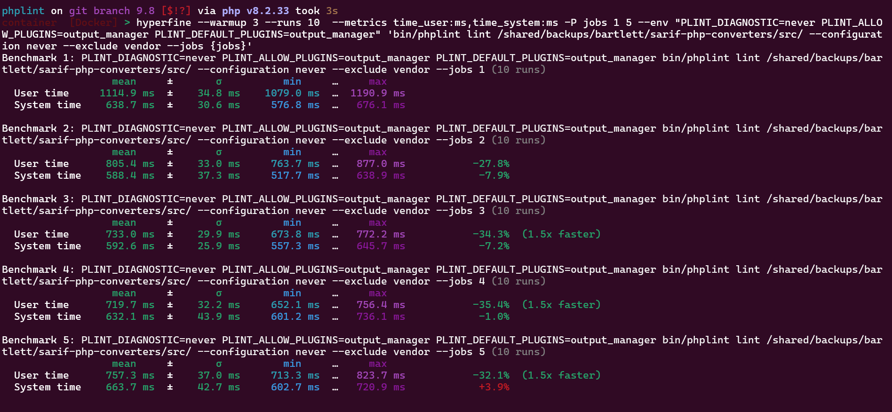
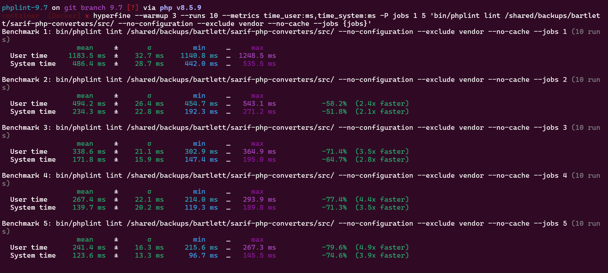
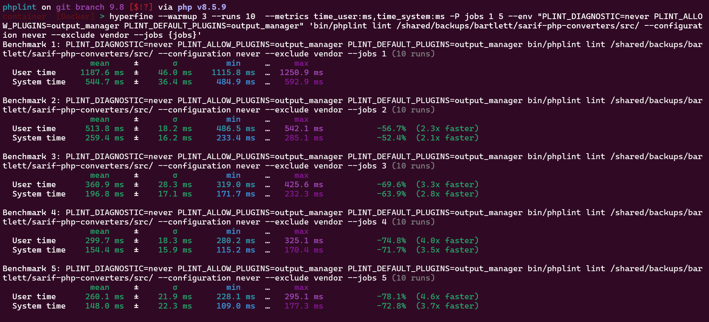

# Benchmarks

- With previous versions of PHPLint until 9.7, we used the [PHP Benchmarking framework][phpbench].

- With version PHPLint 9.8, we use now the command-line benchmarking tool [Hyperfine][hyperfine] and the most recent [version 2.0][hyperfine-v2].

## Source code to analyze

> [!CAUTION]
> The most important is to use the same source code, whatever it is.
>
> Here we will check one of my project with it's recent update : [SARIF PHP Converters][sarif-php-converters-1.8] 1.8.1

## Benchmarking protocol

> [!CAUTION]
> To compare speed execution of two different version of the same application, we should be in same context.
>
> Same PHPLint extensions loaded : 
>
> - no progress bar (`--no-progress` flag), to get only `output` format available with version 9.7   
> - `PLINT_ALLOW_PLUGINS=output_manager PLINT_DEFAULT_PLUGINS=output_manager` environment variables set with version 9.8
> - `PLINT_DIAGNOSTIC=never` environment variable set to avoid running auto diagnostic (default behavior) with version 9.8

<!-- admonition separator -->

> [!NOTE]
> By default (`-e,--env` platform environment) with the Symfony Console Application, we are in `dev` context.
>
> That means, with PHPLint 9.8, all available extensions are allowed and may be loaded depending of arguments provided on command line.
> And we want only the `output_manager` (equivalent to `output` format in v9.7) 
>
> Learn more with the [FAQ](FAQ.md)

Now, if the pre-requires is understood, we can prepare the Hyperfine command line :

### Warmup environment

Read official documentation at <https://github.com/sharkdp/hyperfine#warmup-runs-and-preparation-commands>

**The choice retained:** Three warmup runs before the running the actual benchmark (`--warmup 3`) 
and be sure to execute ten benchmarking runs (`--runs 10`).

### Choosing metrics and units

Read official documentation at <https://github.com/sharkdp/hyperfine#choosing-metrics-and-units>

**The choice retained:** User and System time in milliseconds (`--metrics time_user:ms,time_system:ms`).

### Parameterized benchmarks

Read official documentation at <https://github.com/sharkdp/hyperfine#parameterized-benchmarks>

**The choice retained:** Control the PHPLint `jobs` flag varying from 1 to 5 (`-P jobs 1 5` and `{jobs}` placeholder in command line).

### Environment variables

Read official documentation at <https://github.com/sharkdp/hyperfine#environment-variables>

**The choice retained:** With PHPLint 9.8 only (`--env "PLINT_DIAGNOSTIC=never PLINT_ALLOW_PLUGINS=output_manager PLINT_DEFAULT_PLUGINS=output_manager"`)

### Final Hyperfine command to execute

> With PHPLint version 9.7.2 (f9d3fb3)

```shell
hyperfine --warmup 3 --runs 10 --metrics time_user:ms,time_system:ms -P jobs 1 5 'bin/phplint lint /shared/backups/bartlett/sarif-php-converters/src/ --no-configuration --exclude vendor --no-cache --jobs {jobs}'
```

> With PHPLint version 9.8.x-dev (a81901a)

```shell
hyperfine --warmup 3 --runs 10  --metrics time_user:ms,time_system:ms -P jobs 1 5 --env "PLINT_DIAGNOSTIC=never PLINT_ALLOW_PLUGINS=output_manager PLINT_DEFAULT_PLUGINS=output_manager" 'bin/phplint lint /shared/backups/bartlett/sarif-php-converters/src/ --configuration never --exclude vendor --jobs {jobs}'
```

## Benchmarks results

> [!NOTE]
> On my platform :
> 
> - Ubuntu 24.4 LTS on x86_64 architecture within Docker Container running on Windows 11 / WSL2
> - One version before PHP 8.3 : PHP 8.2.33
> - One version after PHP 8.3 : PHP 8.5.9
>
> PHP add support to linting multiple files at once (`php -l` syntax) on CLI since version 8.3. 
> See [faster process linter request][phplint-request-197] for first implementation on PHPLint 9.7

### PHPLint 9.7 and PHP 8.2



### PHPLint 9.8 and PHP 8.2



### PHPLint 9.7 and PHP 8.5



### PHPLint 9.8 and PHP 8.5



[hyperfine]: https://github.com/sharkdp/hyperfine
[hyperfine-v2]: https://github.com/sharkdp/hyperfine/releases/tag/v2.0.0
[phpbench]: https://github.com/phpbench/phpbench
[sarif-php-converters-1.8]: https://github.com/llaville/sarif-php-converters/releases/tag/1.8.1
[phplint-request-197]: https://github.com/overtrue/phplint/issues/197
