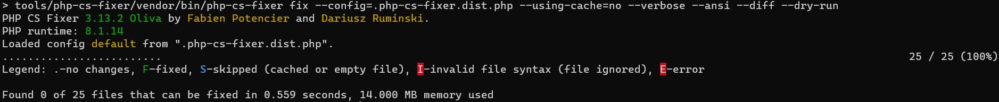

# Contributing

We look forward to your contributions! Here are some examples how you can contribute:

- Report an issue
- Suggest a new feature
- Send a pull request

## Workflow for Pull Requests

1. Fork the repository.
1. Create your branch from `main` if you plan to implement new functionality or change existing code significantly.
1. Implement your change and add tests for it.
1. Ensure the test suite passes.
1. Ensure the code complies with our coding guidelines.
1. Send your Pull Request

## Fork the PHPLint repository

Before starting to contribute to this project, you first need to install code from GitHub:

```shell 
git clone --branch main https://github.com/overtrue/phplint.git
cd phplint 
composer update
```

In an effort to maintain a homogeneous code base, we strongly encourage contributors to run 
[PHP-CS-Fixer][php-cs-fixer] and [PHPUnit][phpunit] before submitting a Pull Request.

All dev tools (`php-cs-fixer`, `phpunit`) are under control of [bamarni/composer-bin-plugin][bamarni/composer-bin-plugin].

## Coding standards

Coding standards are enforced using [PHP-CS-Fixer][php-cs-fixer]

This project comes with a configuration file (located at `/.php-cs-fixer.dist.php` in the repository) 
and an executable for PHP CS Fixer (located at `/tools/php-cs-fixer`) that you can use to (re)format your source code for compliance with this project's coding guidelines:

```shell
composer fix-style
```

If you only want to check source code standard violation, without apply changes, please use instead: 

```shell
composer check-style
```

Here is a preview of what call look like:



## Running Tests

All tests must PASS before submitting a Pull Request.

Three Composer shortcuts are available:

```shell
composer tests:unit
```
Executes all unit tests (that include test suites: `cache`, `configuration`, `finder`)

```shell
composer tests:e2e
```
Execute end-to-end tests (that include test suite `e2e`)

```shell
composer tests:all
```
Execute all tests (unit and end-to-end)

[bamarni/composer-bin-plugin]: https://github.com/bamarni/composer-bin-plugin
[php-cs-fixer]: https://github.com/PHP-CS-Fixer/PHP-CS-Fixer
[phpunit]: https://github.com/sebastianbergmann/phpunit
