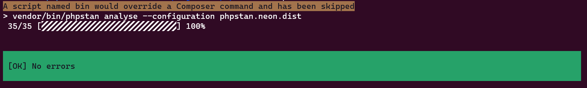
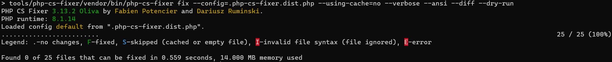

# Contributing

We look forward to your contributions! Here are some examples how you can contribute:

- Report an issue
- Suggest a new feature
- Send a pull request

## Workflow for Pull Requests

1. Fork the repository.
2. Create your branch from `9.7` if you plan to implement new functionality or change existing code significantly.
3. Implement your change and add tests for it.
4. Ensure the test suite passes.
5. Ensure the code complies with our coding guidelines.
6. Send your Pull Request

## Fork the PHPLint repository

Before starting to contribute to this project, you first need to install code from GitHub:

```shell 
git clone --branch 9.7 https://github.com/overtrue/phplint.git
cd phplint 
composer update
```

In an effort to maintain a homogeneous code base, we strongly encourage contributors to run 
[PHPStan][phpstan], [PHP-CS-Fixer][php-cs-fixer] and [PHPUnit][phpunit] before submitting a Pull Request.

All dev tools (`phpstan`, `php-cs-fixer`, `phpunit`) are under control of [bamarni/composer-bin-plugin][bamarni/composer-bin-plugin].

## Static Code Analysis

Static analysis of source code is provided using [PHPStan][phpstan]

```shell
composer bin phpstan update
```

This project comes with a configuration file (located at `/phpstan.neon.dist` in the repository)
and an executable for PHPStan (located at `vendor/bin/phpstan`) that you can use to analyse your source code for compliance with this project's coding guidelines:

```shell
vendor/bin/captainhook hook:pre-push -c .config/captainhook/pre-push.phpstan.json
```

Here is a preview of what call look like:



## Coding standards

Coding standards are enforced using [PHP-CS-Fixer][php-cs-fixer]

```shell
composer bin php-cs-fixer update
```

This project comes with a configuration file (located at `/.php-cs-fixer.dist.php` in the repository) 
and an executable for PHP CS Fixer (located at `vendor/bin/php-cs-fixer`) that you can use to check source code standard violation, 
without apply changes:

```shell
vendor/bin/captainhook hook:pre-commit -c .config/captainhook/pre-commit.phpcs-fixer.json
```

Here is a preview of what call look like:



## Running Tests

Regression tests are checked using [PHPUnit][phpunit]

```shell
composer bin phpunit update
```

All tests must PASS before submitting a Pull Request.

```shell
vendor/bin/phpunit
```
Executes all unit tests (that include test suites: `cache`, `configuration`, `finder`, `output`)

```shell
vendor/bin/phpunit --testsuite e2e
```
Execute end-to-end tests (that include test suite `e2e`)

[bamarni/composer-bin-plugin]: https://github.com/bamarni/composer-bin-plugin
[phpstan]: https://github.com/phpstan/phpstan
[php-cs-fixer]: https://github.com/PHP-CS-Fixer/PHP-CS-Fixer
[phpunit]: https://github.com/sebastianbergmann/phpunit
