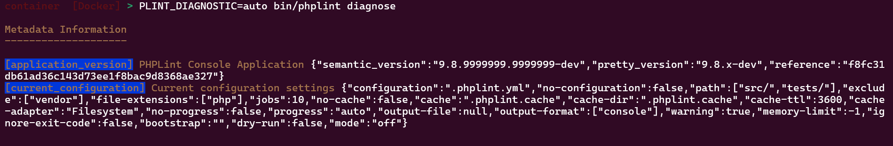
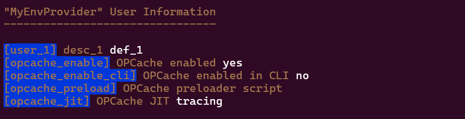
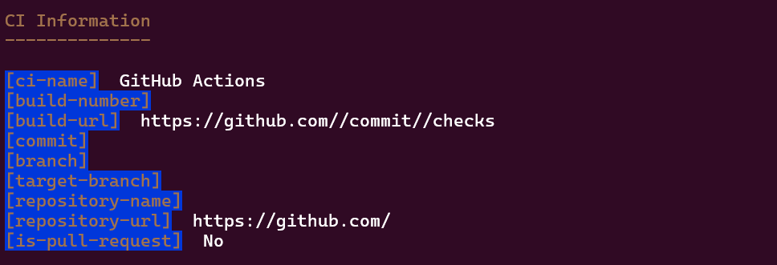
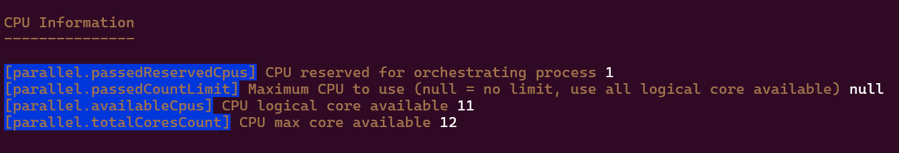
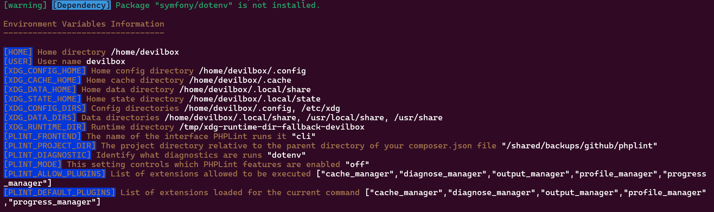
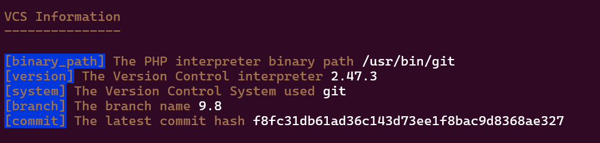
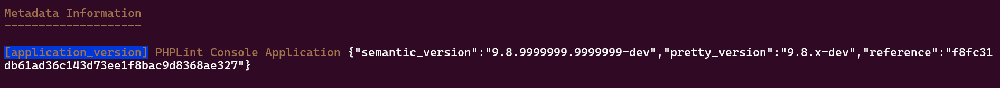
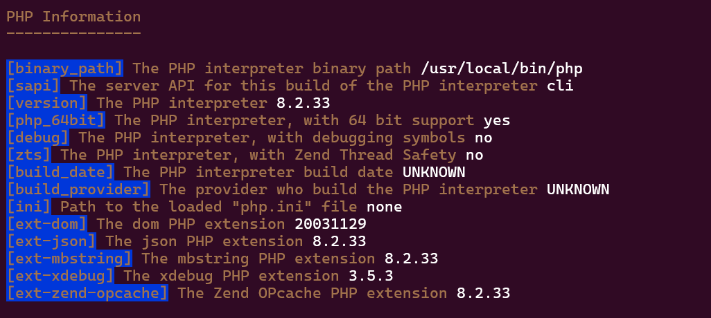
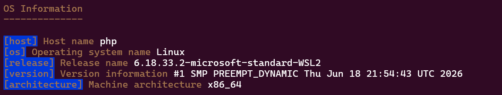

# Diagnose Manager

This extension allow to run a diagnostic after the `lint` command.

> [!WARNING]
> 
> This extension/plugin is allowed (by default) only on the `dev` environment. 
> For other platform/environment, you must explicitly specify it with the `PLINT_ALLOW_PLUGINS` env var.

> [!TIP]
> The `diagnose` command is always available, even if the `diagnose_manager` extension is not loaded.


PHPLint 9.8 supports seven suppliers controlled by the `PLINT_DIAGNOSTIC` environment variable.

You may also print your own data with a "User" provider. To do so, you'll need to specify how to load it 
with the bootstrapping feature.

## Default diagnostic mode

When `PLINT_DIAGNOSTIC` is unset (or set to `auto`), PHPLint prints contents of the `metadata` information:

- `application_version` : PHPLint Console Application Version (full detailed)
- `current_configuration` : Current configuration settings (depending on your configuration file, if any)

```shell
phplint diagnose
PLINT_DIAGNOSTIC=auto phplint diagnose
PLINT_DIAGNOSTIC=auto phplint diagnose --verbose
PLINT_DIAGNOSTIC=auto phplint diagnose -e ci
PLINT_DIAGNOSTIC=auto phplint diagnose --env prod
```

For example :



## Always mode

Prints all data of the seven suppliers (currently supported) by PHPLint 9.8

```shell
PLINT_DIAGNOSTIC=always phplint diagnose
PLINT_DIAGNOSTIC=always phplint diagnose -e ci
PLINT_DIAGNOSTIC=always phplint diagnose --env prod
```

## Never mode

Do not print any diagnostic information.

```shell
PLINT_DIAGNOSTIC=never phplint diagnose
PLINT_DIAGNOSTIC=never phplint diagnose -e ci
PLINT_DIAGNOSTIC=never phplint diagnose --env prod
```

> [!TIP]
> This is also TRUE, if you invoke the `diagnose` command with the standard Symfony Console `--quiet` flag.
> ```shell
> phplint diagnose --quiet
> ```

> [!NOTE]
> The exit status code is then set to 127 (none result produced).

## User diagnostic

For example:

```shell
PLINT_DIAGNOSTIC=MyEnvProvider phplint diagnose --bootstrap examples/envProvider/bootstrap.php
```

For example :



## CI diagnostic

Provide information of current build on your CI platform.

```shell
PLINT_DIAGNOSTIC=ci phplint diagnose
PLINT_DIAGNOSTIC=ci GITHUB_ACTIONS=true bin/phplint diagnose 
```

For example :



You need to install following [ondram/ci-detector] package, and read its documentation to learn how to use it !

```shell
composer bin ci-detector update
```

## CPU diagnostic

Provide CPU information on your current platform.

```shell
PLINT_DIAGNOSTIC=cpu phplint diagnose
```

You need to install following [fidry/cpu-core-counter] package, and read its documentation to learn how to use it !

```shell
composer bin cpu-detector update
```

For example :



## DotEnv diagnostic

Provide information of your environment variables related to PHPLint features.

```shell
PLINT_DIAGNOSTIC=dotenv phplint diagnose
```

If you prefer to use an `.env` file to register your environment variables, 
you will need to install [symfony/dotenv] package, and read its documentation to learn how to use it !

For example :



## VCS diagnostic

Provide VCS (Git) information on your current platform.

```shell
PLINT_DIAGNOSTIC=vcs phplint diagnose
```

For example :



## Metadata diagnostic

Provide metadata information (version, configuration file settings) of your PHPLint environment.

```shell
PLINT_DIAGNOSTIC=metadata phplint diagnose
PLINT_DIAGNOSTIC=metadata:application_version phplint diagnose
PLINT_DIAGNOSTIC=metadata:current_configuration phplint diagnose
```

For example (with `metadata:application_version`) :



## PHP diagnostic

Provide PHP information on your current platform.

```shell
PLINT_DIAGNOSTIC=php phplint diagnose
```

For example :



## Uname diagnostic

Provide OS information on your current platform.

```shell
PLINT_DIAGNOSTIC=uname phplint diagnose
```

For example :



[ondram/ci-detector]: https://github.com/ondram/ci-detector
[fidry/cpu-core-counter]: https://github.com/theofidry/cpu-core-counter
[symfony/dotenv]: https://github.com/symfony/dotenv
