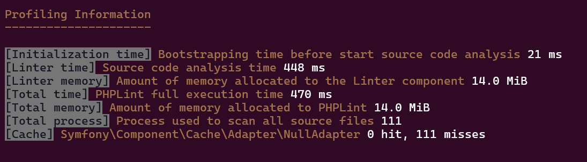

# Profile Manager

This extension is in charge to display what are resources consumed by PHPLint.

> [!NOTE]
> It will expose one additional flag (`--profile`) to the core `lint` command (the only one allowed).

Supported values are:

- `auto` : Print profiler output (time and memory consumed; cache hits and missed) 
- `never`: Suppress any profiler output 

> [!CAUTION]
> The `profile_manager` extension/plugin is allowed/loaded only :
>
> - on two modes (`PLINT_MODE`) : `develop` or `profile`,
> - when `legacy` mode is on with verbose level >= 1
> - when the frontend (`PLINT_FRONTEND`) is interactive (TRUE on default `cli` PHP SAPI).
 
You should consider to enable it explicitly in other cases :

```shell
PLINT_FRONTEND=cli PLINT_ALLOW_PLUGINS=profile_manager phplint lint -x profile_manager /path/to/source/code -e ci --profile auto
PLINT_FRONTEND=cli PLINT_ALLOW_PLUGINS=profile_manager PLINT_DEFAULT_PLUGINS=profile_manager phplint lint /path/to/source/code -e ci --profile auto
```

## Default profiler display

With `--profile auto` flag :

Here is preview of what it will look like :


