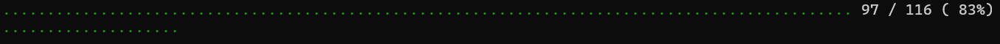
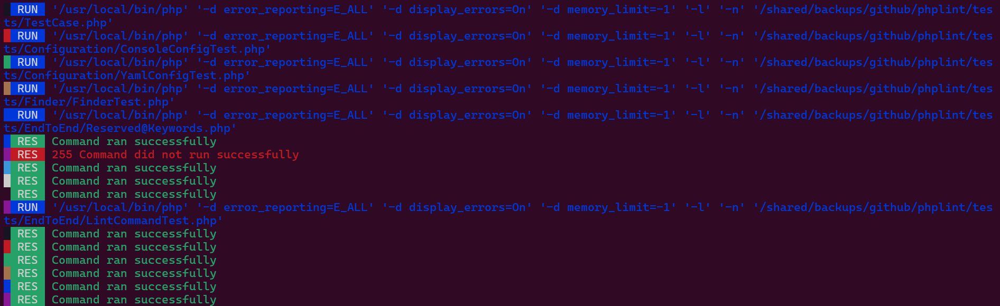

# Progress Manager

This extension is in charge to handle properly the file checking progression depending on the format supported.

Set type of progress output with `--progress` flag.

Supported values are:

- `auto` (default): Print progress output like `--progress dots` (or `--progress printer` previous value supported but now deprecated)
- `dots`: (same as `--progress printer` deprecated flag option)
- `plain`: Prints the raw build progress in a plaintext format (same as `--vv`: verbose level 2)
- `bar`: Prints a standard Symfony Progress Bar.
- `indicator`: Let users know that the `phplint` command isn't stalled.
- `quiet`: Suppress any progression output (same as `--no-progress` deprecated flag option)

> [!CAUTION]
> The `progress_manager` extension/plugin is not allowed/loaded by default on other environment than `dev`,
> except for the special `legacy` mode.
>
> You should consider to enable it explicitly.

```shell
PLINT_FRONTEND=cli PLINT_ALLOW_PLUGINS=progress_manager phplint lint -x progress_manager /path/to/source/code -e ci --progress auto
PLINT_FRONTEND=cli PLINT_ALLOW_PLUGINS=progress_manager PLINT_DEFAULT_PLUGINS=progress_manager phplint lint /path/to/source/code -e ci --progress auto
```

> [!TIP]
> The `PLINT_MODE=legacy` enabled and activated the `cache_manager`, `output_manager` and `progress_manager` extensions,
> whatever environment (`-e, --env`, `PLINT_ENV`) you are in.

## Default progression display

With `--progress auto` (or `--progress dots`) flag :

Here is preview of what it will look like :



## Plain progression display

With `--progress plain` flag :

Here is preview of what it will look like :



## Bar progression display

With `--progress bar` flag :

This flag option is responsible to print progress of file checking with the [Symfony ProgressBar Console Helper][symfony-progressbar]

Here is preview of what it will look like :


## Indicator progression display

With `--progress indicator` flag :

This flag option is useful to let users know that the `phplint` command isn't stalled.
Learn more with the official Symfony documentation on [ProgressIndicator Console Helper][symfony-progressindicator]


[symfony-progressbar]: https://symfony.com/doc/current/components/console/helpers/progressbar.html
[symfony-progressindicator]: https://symfony.com/doc/current/components/console/helpers/progressindicator.html